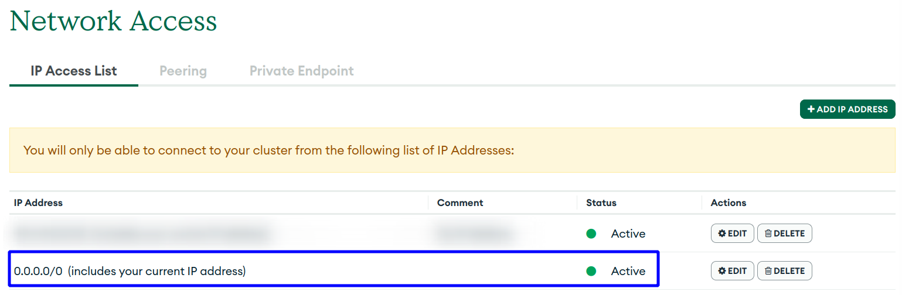

# Challenge 17

## Deploy on Heroku

### Instructions

- Create a project in Heroku.com to upload the server that we have been doing, reforming everything necessary for its proper functioning in the cloud.

- Upload the code to Heroku.com, without forgetting to include the .gitignore file to avoid uploading the node_modules. Check that the project starts correctly in the cloud. Verify that the server's public page is in your root path.

- The server must continue to function locally.

- Make a change of choice in any view, test locally and upload the project to Heroku again, verifying that the new reform is available online.

- Check through a local console, the messages sent by our server in Heroku to your own console.

----
### Solution

**Deploy:** https://deployentrega17.herokuapp.com


In order to deploy this project, I had to stop using local MongoDB and use MongoDB Atlas, so the following actions were necessary for everything to work properly:

1. Change the key **MONGO_URI** in our **.env**

```console

MONGO_URI=mongodb+srv://<USER>:<PASSWORD>q@cluster0.lmstd.mongodb.net/<DB>?retryWrites=true&w=majority

```

2. Do not *hard-code* the port directly.

```js
const PORT = process.env.PORT;
const server = app.listen(PORT, () => {
    logger.info(`🚀 Server started at http://localhost:${PORT}`)
    })
    
server.on('error', (err) => logger.error(err));
```

3. Set the 'start' script in our package.json

```json
  "scripts": {
    "start": "node ./src/server.js"
  }
```

4. Enable all IPs in our MongoDB Atlas, otherwise access from Heroku (and from abroad) will be denied

