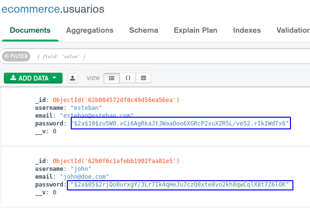

# Challenge 18
The same that I have accumulated plus what is defined here below
----

## Registro de usuarios y aviso por email de la operación

- Create a new user

- We observe that a new document has been created in our Mongo base, in addition the password is encrypted

- We receive an email informing the UUID and date on which this user was generated.

