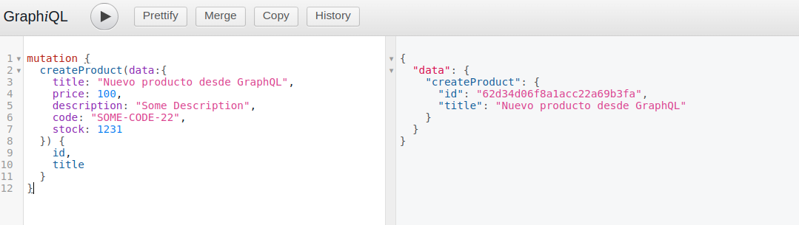

# Challenge 22

## Reform to use GraphQL

### Instructions

- Based on the latest RESTful API server deliverable project, reform the routing layer and the controller so that the requests can be made through the GraphQL query language.
- If we had a frontend, reform it to support GraphQL and be able to properly dialogue with the backend and thus carry out the different operations of requesting, saving, updating and deleting resources.
- Use GraphiQL to perform functional testing of queries and mutations.

----

In the `graphql` folder, inside src all the files needed to use **GraphQL** were created.
```console

graphql
├── inputs
│   ├── ProductoNew.input.js
│   └── ProductoUpdate.input.js
├── mutations
│   ├── CreateCarrito.mutation.js
│   ├── CreateProducto.mutation.js
│   ├── DeleteCarritoById.mutation.js
│   ├── DeleteProductById.mutation.js
│   ├── DeleteProductFromCart.mutation.js
│   ├── SaveProductToCart.mutation.js
│   └── UpdateProductById.mutation.js
├── queries
│   ├── GetAllCarritos.query.js
│   ├── GetAllProductos.query.js
│   ├── GetAllProductsFromCartById.query.js
│   └── GetProductById.query.js
├── Schema.js
└── types
    ├── Carrito.type.js
    └── Producto.type.js
```

To access GraphQL go to

### `http://localhost:3031/graphql`

#### Example of a mutation (create a new product)



#### Example of a query

