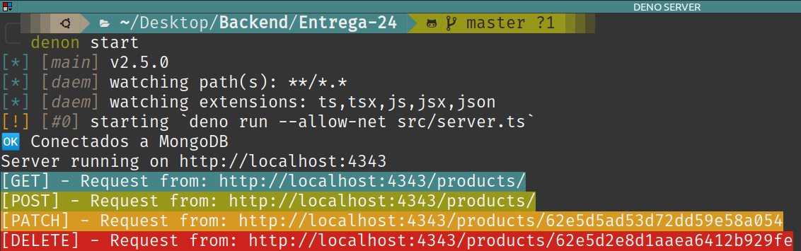

# Challenge 24

## Server in Deno

Simple server in Deno with data persistence in MongoDB.

To start scripts.json (when creating a new project):
#### `denon --init`

To run the script that starts the server, in **Delivery-24/**:
#### `denon start`

According to each type of request, a different color is displayed in the terminal.

