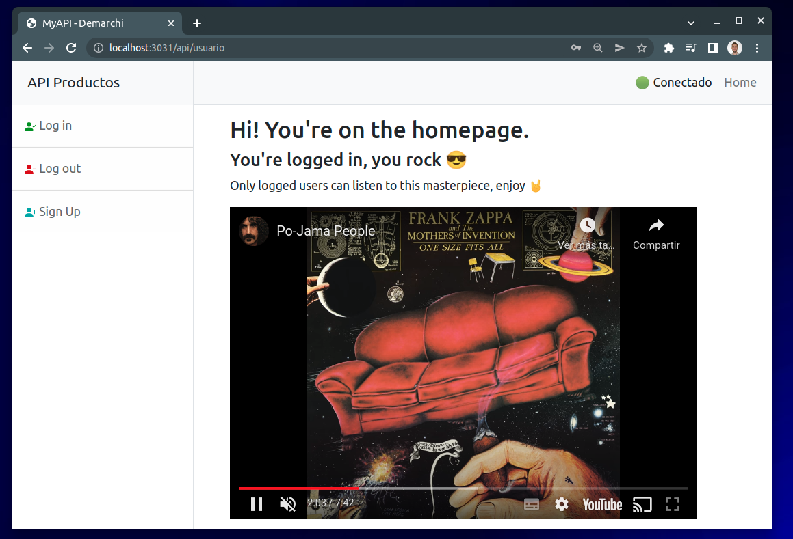
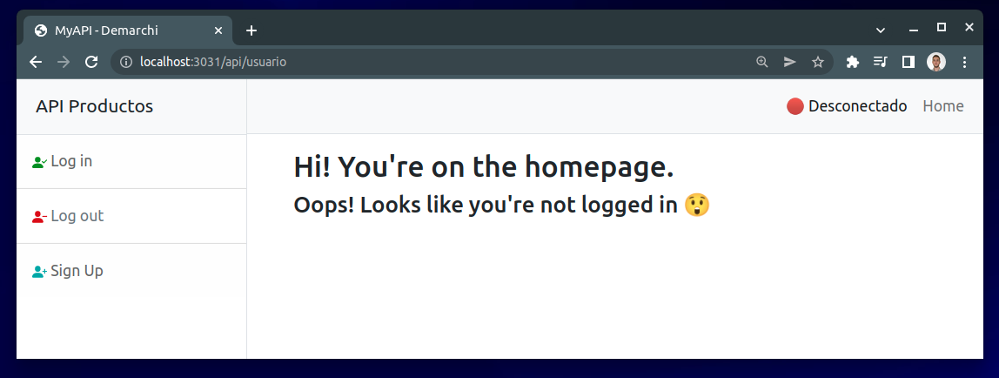
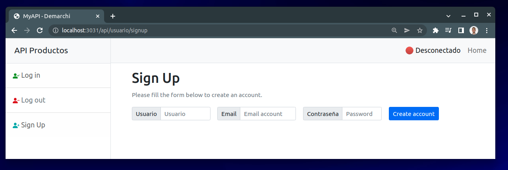
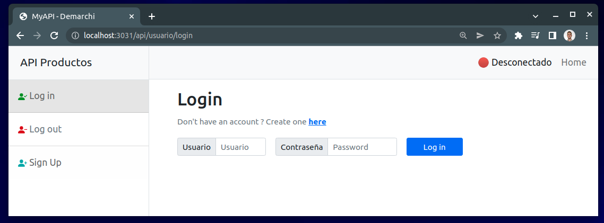
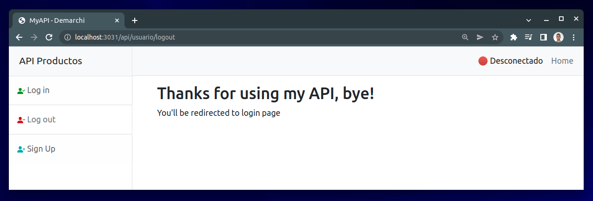

# Final Delivery

This installment includes what was done in the previous ones, to see the details you can see each README.

## Login, Logout y SignUp of User

### Home

In `/api/usuario`

- ✅ If the user is logged in:

- ❌ If the user is **not** logged in:

### Sign Up

En `/api/usuario/signup`

💡 If you have configured the gmail account and removing the comment from `user.controller.js:28` you will receive an email that a new user has been created.

### Log in

In `/api/usuario/login`

### Log out

In `/api/usuario/logout`

